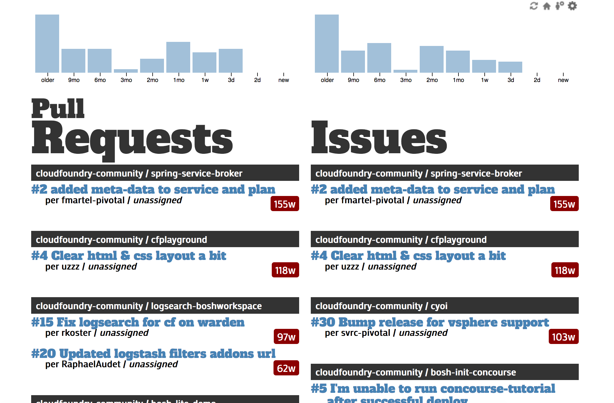

# Optigit

A dashboard that allows you to track the outstanding pull requests
and issues on orgs/repositories of your choosing.



## Testing

```
$ make
$ GITHUB_TOKEN=1234 DATABASE=sqlite3:test.db ORGS=test ./optigit
```
